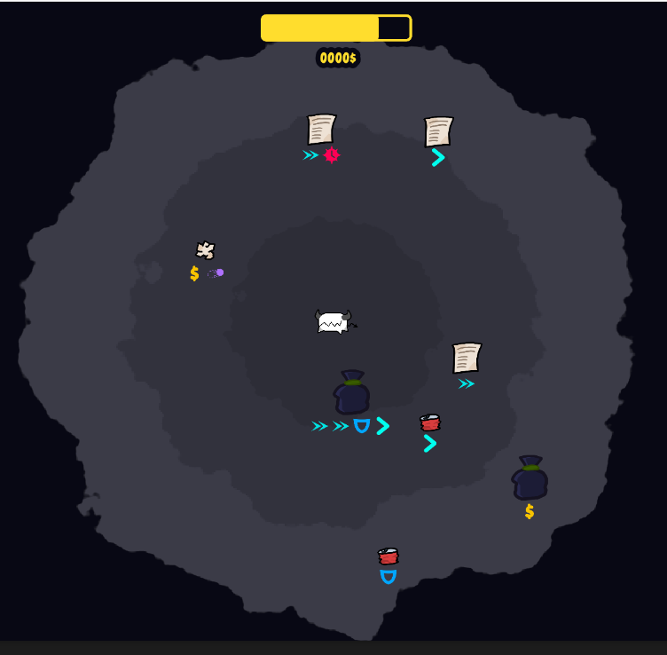
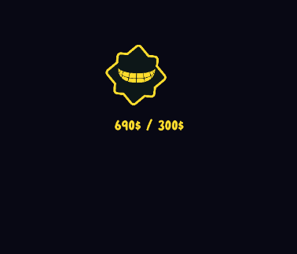
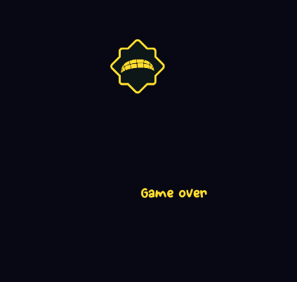
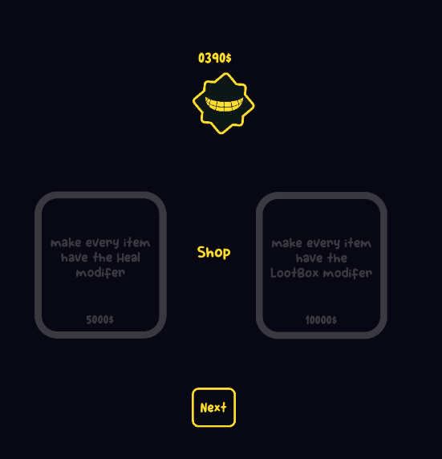
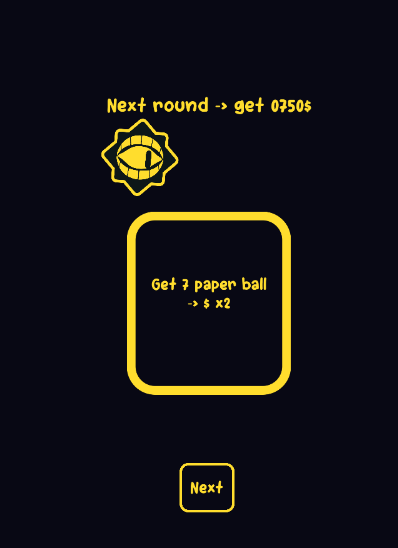
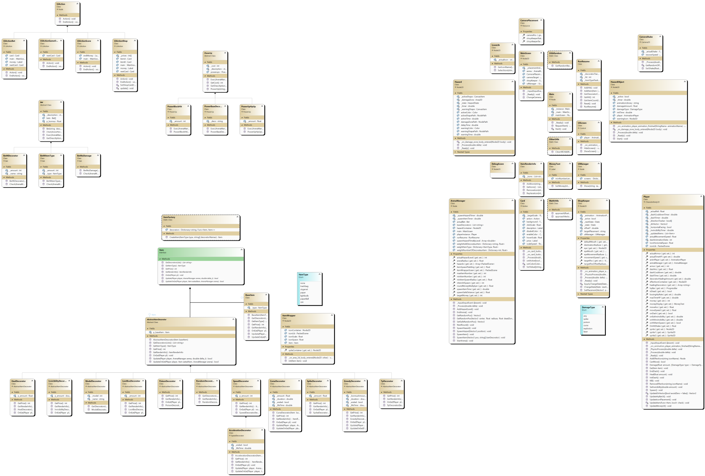
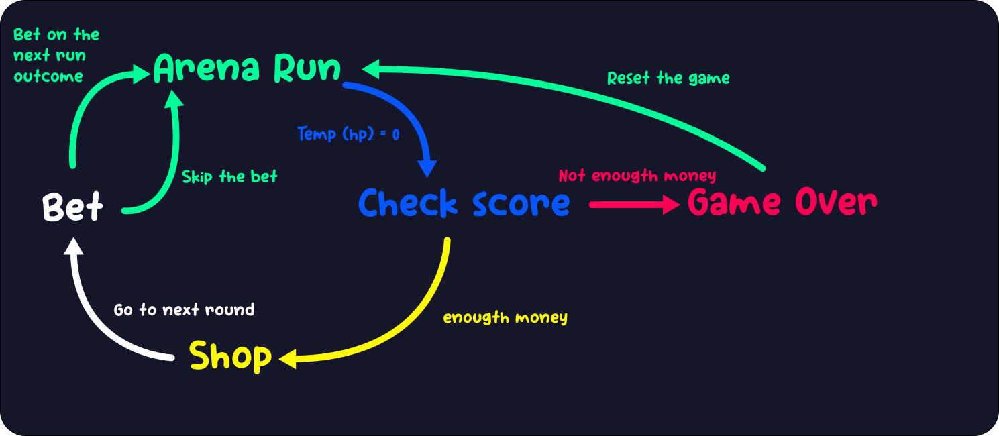

# ScrapEat - Décorateur
Auteurs: Théo Bensaci, Aurelien Bloch, Nicolas Bovard

## Structure du projet
Cette section a été généré par IA et vérifié. Ceci afin de simplifier la compréhension de la structure du projet.
### Scripts de jeu

| Fichier | Rôle dans le projet |
|---|---|
| script/CameraShake.cs | Caméra avec secousse visuelle lors des dégâts. |
| script/arena/ArenaManager.cs | Gestion de l'arène, du spawn des objets, des hazards, du score de round et du passage entre phases. |
| script/arena/Hazard.cs | Hazard temporisé avec phase d'avertissement, phase active et disparition. |
| script/arena/HazardObject.cs | Hazard animé qui active une zone de dégâts après un délai. |
| script/arena/RunResume.cs | Historique de des dégâts égaux à la moitié des HP temporels actuels. |
| script/itemSystem/Decorateur/effectDecorator/RandomDecorator.cs | Remplace l'icône finale par Random et représente un décorateur aléatoire. |
| script/itemSystem/Decorateur/effectDecorator/SpeedDecorator.cs | Augmente la vitesse de déplacement du joueur à la consommation. |
| script/itemSystem/Decorateur/effectDecorator/SpikeDecorator.cs | Inflige des dégâts immédiats à la consommation. |
| script/itemSystem/Decorateur/effectDecorator/TpDecorator.cs | Téléporte le joueur à une position aléatoire. |
| script/other/CameraPlacement.cs | Ressource décrivant une position caméra et l'état associé du shopkeeper. |
| script/other/Card.cs | Bouton de carte avec animation de hover/clic et callback d'action. |
| script/other/IconsLib.cs | Sélection visuelle d'une icône dans le prefab d'icônes. |
| script/other/MainSceen.cs | Orchestration de la caméra, du shopkeeper, de l'arène et de l'UI. |
| script/other/MoneyText.cs | Affichage formaté de l'argent. |
| script/other/utils.cs | Fonctions utilitaires de hasard, d'approche de valeurs et de nettoyage de nœuds. |
| script/other/ui/UiAction.cs | Base abstraite pour les actions exécutées lors de l'affichage d'un écran UI. |
| script/other/ui/UiManager.cs | Gestion des écrans UI disponibles. |
| script/other/ui/UiScreen.cs | Contrôle l'animation show/hide d'un écran UI et déclenche ses actions. |
| script/other/ui/action/UiActionShop.cs | Génère les cartes de boutique et les powerups proposés. |
| script/other/ui/action/UiActionBet.cs | Génère l'enjeu de pari et le passage à la manche suivante. |
| script/other/ui/action/UiActionScore.cs | Affiche le résultat du round et choisit Shop ou GameOver. |
| script/player/DamageType.cs | Enum des types de dégâts. |
| script/player/Player.cs | Déplacement, dash, consommation d'items, dégâts, soins, UI et gestion de l'état du joueur. |
| script/powerUpAndBet/Bet.cs | Base des paris proposés entre les rounds. |
| script/powerUpAndBet/BetNDecorator.cs | Pari basé sur le nombre d'items d'un type précis consommés. |
| script/powerUpAndBet/BetNoDamage.cs | Pari basé sur l'absence de dégâts reçus. |
| script/powerUpAndBet/PowerUp.cs | Base des powerups achetables au shopkeeper. |
| script/powerUpAndBet/PowerUpArenaChange.cs | PowerBaseDecorator, powerup qui ajoute un décorateur de base à tous les futurs items. |
| script/powerUpAndBet/PowerUpPlayerStateChange.cs | PowerUpHpUp et PowerBlockHit, qui modifient respectivement les HP max et l'armure. |
| script/shop/ShopKeeper.cs | Gestion du shopkeeper, de ses états visuels et de son déplacement vers la cible. |

### Scènes Godot

| Fichier | Rôle dans le projet |
|---|---|
| sceen/main_sceen.tscn | Scène principale réellement référencée au lancement du projet. |
| sceen/debug_sceen.tscn | Scène de debug. |
| object/player.tscn | Scène instanciée pour le joueur. |
| object/item_wrapper.tscn | Scène d'affichage d'un item au sol. |
| object/shop_keeper.tscn | Scène du shopkeeper. |
| object/hazard_explosion.tscn | Hazard de type explosion. |
| object/hazard_lazer.tscn | Hazard de type laser. |
| object/card.tscn | Carte UI de boutique ou de pari. |
| object/smallCard.tscn | Carte UI secondaire. |
| object/ui_action.tscn | Conteneur d'action UI. |
| object/ui_screen.tscn | Écran UI animé avec show/hide. |
| object/icons_lib.tscn | Bibliothèque d'icônes utilisée par les items. |

### Ressources et shaders

| Fichier | Rôle dans le projet |
|---|---|
| art.svg | Ressource graphique racine. |
| icon.svg | Icône du projet Godot. |
| shopkeeper.png | Illustration du shopkeeper à la racine. |
| ressource/Om Botak.ttf | Police utilisée pour l'UI. |
| ressource/shopkeeper.png | Ressource image du shopkeeper. |
| ressource/sprite/player.png | Sprite du joueur. |
| ressource/sprite/card.png | Sprite utilisé pour les cartes UI. |
| ressource/sprite/icons.png | Atlas d'icônes. |
| ressource/sprite/shopkeeperDeathMouth.png | Sprite de bouche de mort du shopkeeper. |
| ressource/sprite/junk_1.png à junk_6.png | Modèles visuels de junk pour les items. |
| ressource/sprite/idk.png | Sprite supplémentaire présent dans le projet. |
| ressource/sprite/cercle.svg | Sprite circulaire utilisé comme base visuelle. |
| ressource/sprite/cat.png | Sprite supplémentaire présent dans le projet. |
| shader/background.gdshader | Shader de fond. |
| shader/hit_sprite.gdshader | Shader utilisé pour les sprites d'impact. |
| shader/itemShader.gdshader | Shader utilisé pour le rendu des items. |

## Contexte du projet

ScrapEat est un jeu réalisé avec Godot 4.5 en C# implémentant le pattern décorateur. Le projet repose sur une boucle en deux phases. La première phase se déroule dans une arène où le joueur peut se déplacer et effectuer un dash. Le but est de manger les déchêts aparaissant aléatoirement sur la carte en passant dessus.

Le jeu n'utilise pas une barre de points de vie classique. Le joueur possède une barre de temps qui détermine sa barre de vie. Chaque dégats que va prendre le joueur va descendre cette barre. Quand elle atteint zéro, le joueur meurt, la phase d'arène se termine et la caméra bascule vers l'écran de score.

Si le joueur n'atteint pas le score demandé, le jeu annonce Game Over.

La seconde phase se déroule chez le shopkeeper, où les objets ramassés sont transformés en argent, et où le joueur peut acheter des powerups.

Enfin, just avant de reprendre la prochaine manche, le shopkeeper va proposer un paris, que le joueur a le choix d'accepter. Ceci peut augmenter ou diminuer les gains du joueurs selon s'il arrive à remplir la condition.

## Architecture de l'application

L'exécution commence dans Main.cs, qui instancie la scène principale. MainSceen relie ensuite les trois blocs fonctionnels du jeu: ArenaManager, ShopKeeper et UiManager. La scène principale définit aussi plusieurs placements de caméra via CameraPlacement, ce qui permet de passer proprement d'une zone à une autre: Arena -> Score ->Shop -> Bet ou Arena -> Game Over

ArenaManager gère tout ce qui est généré pendant une manche. Il crée les items, contrôle leur fréquence d'apparition, choisit leur position dans l'arène, maintient le niveau de danger, et active les hazards au fil du temps. Lorsque la manche est relancée, l'arène est nettoyée, un nouveau RunResume est créé, les items initiaux sont réapparus et le joueur est respawn si nécessaire.

Player gère le déplacement, le dash, l'interface de vie et l'argent. Lorsqu'un item est mangé, son effet immédiat est exécuté, puis les effets persistants déjà actifs sont mis à jour. Le joueur conserve aussi la liste des items déjà consommés pour permettre aux décorateurs à durée de vie et aux effets cumulatifs de continuer à agir.

ShopKeeper gère la phase marchande. Il se déplace vers une cible définie par la caméra, change d'état visuel selon le contexte, et affiche les écrans UI correspondants via UiManager. Les cartes de boutique et de pari sont construites par Card, UiActionShop, UiActionBet et UiActionScore.

## UML

## Mise en œuvre du modèle décorateur

Le pattern décorateur est la condition centrale du projet et il est utilisé pour enrichir les items sans modifier leur classe de base. L'idée appliquée ici est simple: un item peut être composé de plusieurs couches de décorateurs, et chaque couche ajoute soit un effet, soit une information de rendu, soit un calcul de prix.

### Structure du modèle

| Composant | Rôle concret |
|---|---|
| Item | Interface commune des items. Définit le rendu, la liste des décorateurs, l'effet à la consommation, le prix et deux callbacks d'update. |
| BaseItem | Implémentation neutre de départ, avec un prix de base de 10 et aucun effet. |
| AbstractItemDecorator | Base du décorateur qui encapsule un autre Item et délègue les appels vers lui. |
| ItemRenderInfo | Contient le modèle visuel du junk et la liste des icônes affichées. |
| ItemFactory | Compose les items à partir d'une liste de noms de décorateurs. |
| ItemWrapper | Convertit ItemRenderInfo en affichage concret dans la scène Godot. |
| RunResume | Mémorise les items mangés et les coups reçus pour les paris. |

### Chaîne de composition

La fabrique ItemFactory reçoit une liste de noms de décorateurs. Elle part toujours d'un BaseItem, puis applique les décorateurs un par un dans l'ordre de la liste. Cette logique permet d'empiler plusieurs effets sur un même objet. Par exemple, un item peut à la fois changer de modèle visuel, soigner le joueur, infliger des dégats au joueur, et déclencher une malédiction (effet temporaire).

Le système de rendu est séparé des effets. `ItemRenderInfo` stocke le model et les icônes. Les décorateurs de type `ModelDecorator` et `effectDecorator` modifient cette structure en ajoutant ou remplaçant des informations visuelles, puis `ItemWrapper` lit ces données pour afficher le bon sprite et les bonnes icônes dans la scène.

Les effets sont répartis sur plusieurs points de contrôle. `OnEat` gère les effets instantanés. `UpdateOnEat` est appelé sur les items déjà actifs lorsqu'un nouvel item est mangé. `Update` est appelé à chaque frame pour les effets qui durent dans le temps.
Ce découpage permet de gérer proprement les buffs/amlus temporaires, les buffs/malus retardés et les mécaniques cumulatives.

### Liste des effets des items - Décorateurs

| Décorateurs | Effet |
|---|---|
| ModelDecorator | Change le modèle visuel et stocke le nom de l'effet dans la liste des décorateurs de l'item |
| SpeedDecorator | Augmente la vitesse du joueur lorsqu'il mange l'item |
| AccelerationDecorator | Ajoute un bonus de vitesse temporaire, puis le retire à la fin de sa durée |
| TpDecorator | Téléporte le joueur à une position aléatoire dans l'arène |
| LootBoxDecorator | Génère plusieurs items autour du joueur, en bloquant le LootBox sur ces nouveaux items pour éviter une boucle |
| HealDecorator | Soigne le joueur |
| InvicibilityDecorator | Ajoute une invincibilité temporaire |
| GreedyDecorator | Ajoute de l'argent à chaque item mangé pendant sa durée active |
| SpikeDecorator | Inflige des dégâts immédiats |
| PoisonDecorator | Divise le temps actuels par deux |
| CurseDecorator | Inflige des dégâts après une période sans manger |
| RandomDecorator | Représente un décorateur aléatoire dans la liste des décorateurs |

### Utilisation du pattern dans le spawn

Le spawn des items dans ArenaManager construit une liste de décorateurs en combinant plusieurs sources. Il choisit d'abord le visuel du déchêt. Il ajoute ensuite un certain nombre de décorateurs sur ce déchêt. Il ajoute enfin les décorateurs imposés par certains powerups de partie (achetable dans le shop), puis retire ceux qui sont explicitement bannis (aussi achetable dans le shop).

Ce mécanisme rend les items décorables de façon procédurale et permet au design du jeu d'attribuer une rareté ou des effets à chaque objet sans multiplier les classes d'items. Les décorateurs influencent aussi la valeur de l'objet, ils vont ajouteur leur propre surcoût au pris du déchêt.

### Interaction déchêt - joueur

Lorsque le joueur mange un item, l'item exécute d'abord son effet immédiat. Le joueur enregistre ensuite cet item dans `RunResume` et le conserve dans sa liste d'items actifs. À chaque frame, les items actifs reçoivent Update, ce qui permet aux effets à durée limitée de continuer à s'appliquer. Lorsqu'un nouveau item est mangé, les items actifs reçoivent aussi `UpdateOnEat`, ce qui permet aux effets comme *Greedy* ou *Curse* de réinitialiser leur timer.

## Utilisation de l'application

Le projet se lance depuis Godot avec la scène principale définie dans project.godot.

**Contrôles**:
- W, A, S, D pour se déplacer.
- Espace pour déclencher le dash
- 1 pour relancer la partie via Main.RequestStart.

**Flux**:

## Conclusion

Le coeur technique de ScrapEat est le système décorateur appliqué aux items. Il permet de combiner proprement des objets de base, des effets instantanés, des effets persistants et des informations de rendu. Le reste de l'architecture est organisé autour de cette logique: l'arène compose les items, le joueur applique les effets, le shopkeeper et l'UI structurent les phases, et le RunResume conserve les statistiques nécessaires aux paris.
